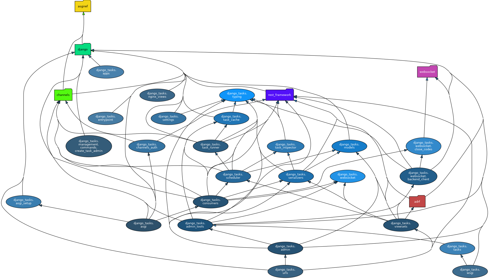

Django Channel Tasks
====================
A background task runner using the `channels-redis` package, ready to be deployed with Nginx and `Nginx Unit <https://unit.nginx.org/howto/djangochannels/>`_.
It features:

  * A REST API allowing to run defined tasks and store the results in PostgreSQL.
  * A simple implementation of asynchronous Django Admin tasks, scheduled through websocket.

Dependency graph
^^^^^^^^^^^^^^^^
The Python module dependency graph of the `django_tasks` package, as generated by `pydeps` (with `max-bacon=2` and excluding test packages), is the following:

Therefore:

This is basically a general-purpose `Django <https://www.djangoproject.com/>`_ application that integrates `Channels <https://channels.readthedocs.io/en/latest/>`_ and
(`async <https://pypi.org/project/adrf/>`_) `DRF <https://www.django-rest-framework.org/>`_; the `Websocket <https://pypi.org/project/websocket-client/>`_ library is employed by a
client that allows WSGI applications (Django Admin, DRF) to communicate through web-socket with ASGI applications (consumers) capable of managing background tasks with the Python
built-in `asyncio <https://docs.python.org/3.11/library/asyncio.html>`_ library.

Source documentation
^^^^^^^^^^^^^^^^^^^^

.. toctree::
   :maxdepth: 2

   django_tasks/typing.rst
   django_tasks/task_runner.rst
   django_tasks/task_inspector.rst
   django_tasks/task_cache.rst
   django_tasks/models.rst
   django_tasks/scheduler.rst
   django_tasks/serializers.rst
   django_tasks/consumers.rst
   django_tasks/channels_auth.rst
   django_tasks/websocket.rst
   django_tasks/viewsets.rst
   django_tasks/admin_tools.rst
   django_tasks/admin.rst
   django_tasks/settings.rst
